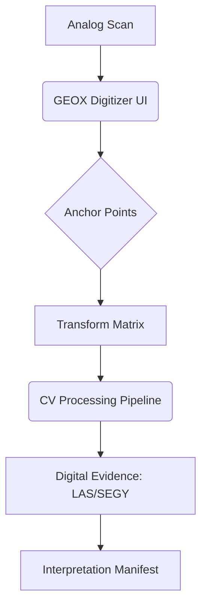

# GEOX Research: Analog-to-Digital Forge (v0.7.1)
## DITEMPA BUKAN DIBERI — The Ignition of Legacy Data

This document outlines the specialized resources and architectural path for digitizing and georeferencing analog geoscience data (scanned logs, seismic sections, maps) within the GEOX 1D/2D stack.

---

## 1. 1D Stack: Well Log Digitization (Image-to-LAS)
Converting PDF/JPG scans of heritage borehole logs into machine-readable LAS 2.0 files.

### 🛠️ Core Resources
- **Hand-Picks/Semi-Auto**: Methodology based on the **KGS E-Log Digitizer**. Use of `scikit-image` for interactive track segmentation.
- **Trace Extraction**: `OpenCV` (Hough Transforms and Contour Detection) for identifying grid lines and curve traces.
- **Normalization**: `Wellio.js` (Frontend formatting) + `lasio` (Backend file construction).
- **Scale Calibration**: Custom `DPI-to-Depth` mapping logic using header-anchor points.

### 🏗️ Blueprint
1. **Header Anchor**: User identifies Top/Bottom depth points on a scanned image.
2. **Track Segmentation**: CV-based detection of track boundaries.
3. **Trace Vectorization**: ML/CV segments the curve from the background grid.
4. **LAS Generation**: `lasio` creates the digital borehole state.

---

## 2. 2D Stack: Seismic & Map Georeferencing
Converting section images into SEG-Y and aligning scanned maps to global CRS.

### 🛠️ Core Resources (Seismic)
- **SEGYRecover**: (a-pertuz) Modern Python-based GUI for vectorization, trace detection, and amplitude density picking. Validated for raster-to-seismic conversion.
- **Seismic Un*x (SU)**: Industry standard processing system for handling digitized data, performing header injection (Shotpoints/Navigation), and final SEGY reformatting.
- **img2segy**: CLI-based conversion using TOML manifest configs for automated batch workflows.
- **segyio**: The high-performance backend for writing digitized amplitudes.

### 🛠️ Core Resources (Maps)
- **GDAL/Rasterio**: The "Universal Translator" for image warping and coordinate transformation.
- **OpenLayers/Leaflet**: Browser-native UI for Ground Control Point (GCP) picking.
- **Georeference Algorithm**: `Thin Plate Spline` (TPS) or `Polynomial` warping for distorted analog paper scans.

### 🏗️ Blueprint
1. **GCP Selection**: Interactive UI for picking image pixels (X, Y) and mapping to coordinates (Lat, Lon) or Seismic Grid indices (CDP, Time).
2. **Warping Engine**: `GDAL` executes the spatial transformation (TPS/Polynomial) on the VPS.
3. **Trace Extraction**: `SEGYrecover` vectorization logic for wiggle-trace extraction.
4. **Header Injection**: Use of `SU` or `segyio` to bind navigation and source/receiver metadata to the digitized traces.

---

## 3. The Governance Layer: Evidence-Grade Objects
Digitized analog data is inherently lower confidence than native digital acquisition. GEOX treats these as **Evidence-Grade Derived Objects**.

### 🔍 Uncertainty & Provenance Capture
- **1D Logs**: Mandatory capture of Scan Source, DPI, Calibration Anchors (Depth/Value), and Extraction Method.
- **2D Maps/Sections**: Mandatory **Residual Error** reporting for GCP-driven transformations. Transformation models must be stored in the manifest.
- **Chain of Custody**: All analog-to-digital transformations must be **Human-Confirmed** before being promoted to structural or petrophysical modeling.

---

## 4. Modular Architecture (Digitization Flow)

---

## 4. Operational Build Order
1. **Sprint A (1D Digitizer)**: Implementation of an interactive Canvas-based log digitizer using `Wellioviz` as the base.
2. **Sprint B (2D Georeferencer)**: Integration of `GDAL` backend tools for map warping via the MCP tool registry.
3. **Sprint C (Seismic Recovery)**: Adoption of `SEGYrecover` logic for vertical section conversion.

---

*DITEMPA BUKAN DIBERI. ALIVE.*
