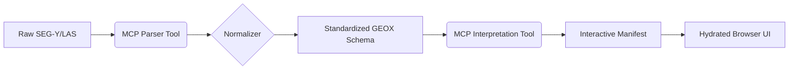

# GEOX Technical Architecture (v0.7.0)
## DITEMPA BUKAN DIBERI — 999 SEAL ALIVE

This document defines the high-precision state of the GEOX Earth Witness platform, moving from a "Fancy UI" prototype to a "Data-Conditioned Interpretation Engine."

---

## 1. Core Philosophy: The Interpretive Manifest
GEOX is NOT a visualization tool. It is an **evidence-graph orchestration layer**. 
- **The Skin**: Open-web visualization (Wellioviz, Plotly, vtk.js).
- **The Machinery**: Interpretation logic (GemPy, arifOS Metabolic Tools).
- **The Contract**: MCP tools return **Interactive Manifests** (JSON-LD) that hydrate the skin, rather than opaque blobs.
- **Legacy Layer**: The [Analog Digitization Mode](ANALOG_DIGITIZATION_MODE_SPEC.md) enables the injection of heritage analog data into the digital evidence graph.

---

## 2. Component Stack

### 🟦 1D: Borehole Environment
- **Parser**: `Wellio.js` (LAS 2.0 to JSON normalization).
- **Renderer**: `Wellioviz` (SVG-based track rendering from JSON templates).
- **Analog Forge**: `LogDigitizer` (CV-based digitization of scanned borehole logs into LAS).
- **Governance**: F9 Anti-Hantu enforces rock-type physics on the log response.

### 🟩 2D: Planar Interpretation
- **Analysis Speed**: `Plotly.js` for cross-plots, stratigraphic charts, and heatmap cross-sections.
- **Seismic Scale**: Custom `WebGL/Canvas` path (referenced from `Seisvis`) for large-scale SEGY textures and attribute picking.
- **Analog Forge**: `MapGeoreferencer` (GDAL-based warping of scanned maps and seismic sections).
- **Coordination**: Proj4js for CRS normalization across maps and sections.

### 🟧 3D: Volume & Basin Modeling
- **Implicit Modeling**: `GemPy` (Interpretation Engine).
- **Rendering**: `vtk.js` (Browser-native scientific visualization).
- **Scene Engine**: CesiumJS (Optional for top-surface geospatial context).

---

## 3. The Data Pipeline (The Interpretation Chain)



### Manifest Schema Example (Interpretation Contract)
```json
{
  "geox_type": "well_track_manifest",
  "provenance": { "floor": "F11_AUTHORITY", "source": "well_01.las" },
  "tracks": [
    { "id": "GR", "unit": "gAPI", "range": [0, 150], "data_ref": "token_gr_001" },
    { "id": "RATLAS_VALIDATION", "overlay": "materials_library_v1" }
  ],
  "picks": [
    { "depth": 1450.5, "label": "Top_Ujung_Pandang", "confidence": 0.88 }
  ]
}
```

---

## 4. MCP Tool Registry & Build Order

### Phase 1: 1D Ignition (Q2-2026)
- **Tool**: `geox_normalize_logs` (Uses Wellio.js on backend).
- **Tool**: `geox_generate_well_manifest` (Returns Wellioviz-compatible config).
- **UI**: Port Well Context Desk to Wellioviz-native rendering.

### Phase 2: 2D Perception & Attributes (Q3-2026)
- **Tool**: `geox_compute_seismic_attributes` (Finished).
- **Tool**: `geox_generate_crossplot` (Returns Plotly figure JSON).
- **UI**: Implementation of full Plotly integration for seismic attribute histograms.

### Phase 3: 3D Structural Seal (Q4-2026)
- **Tool**: `geox_model_structural_gempy` (Implicit structural modeling from horizons/faults).
- **Tool**: `geox_fetch_3d_mesh` (Returns VTK.js/GemPy meshes).
- **UI**: Full vtk.js integration in Basin Explorer.

---

## 5. Sovereign Mandate
The advantage of GEOX is the **Shared Evidence Graph**. Both human interpreters and AI agents interact with the same localized "Manifests." 

*DITEMPA BUKAN DIBERI. ALIVE.*
